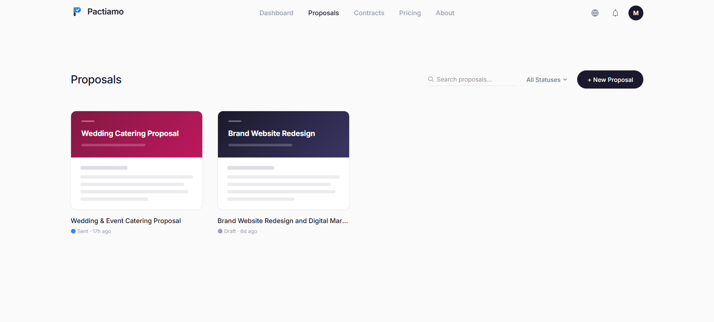
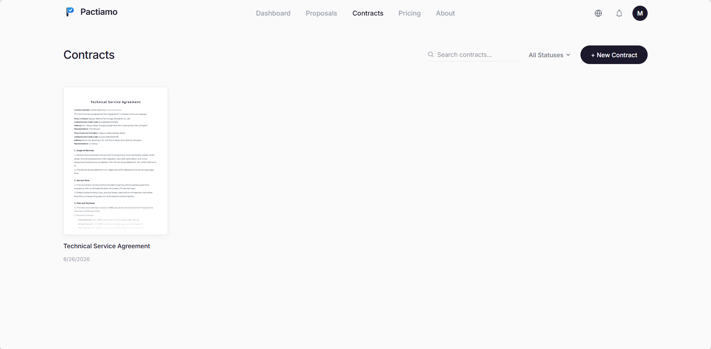

# Pactiamo Features

Our platform is built to remove the friction from your client onboarding process.

## 1. Natural Language Drafting
Stop starting from a blank page. You can describe your project in plain English, and our system will generate a structured proposal and contract draft tailored to your needs.

## 2. Drag and Drop Editor
Customize every aspect of your documents. Our editor provides a WYSIWYG experience that guarantees your document will look exactly the same on the screen as it does when printed on A4 paper.

## 3. Secure E Signatures
Clients can electronically sign documents directly from their browser. Once signed, the document is locked and a comprehensive audit certificate is generated containing the signer identity, timestamp, IP address, and document hash.

## 4. Read Tracking
Never wonder if your client has seen your proposal. You get real time insights into when the document was opened and how long it was viewed.

## 5. Direct Payments
Immediately after signing, your customized payment link is displayed to the client. There are no platform fees and no delays in receiving your funds.
