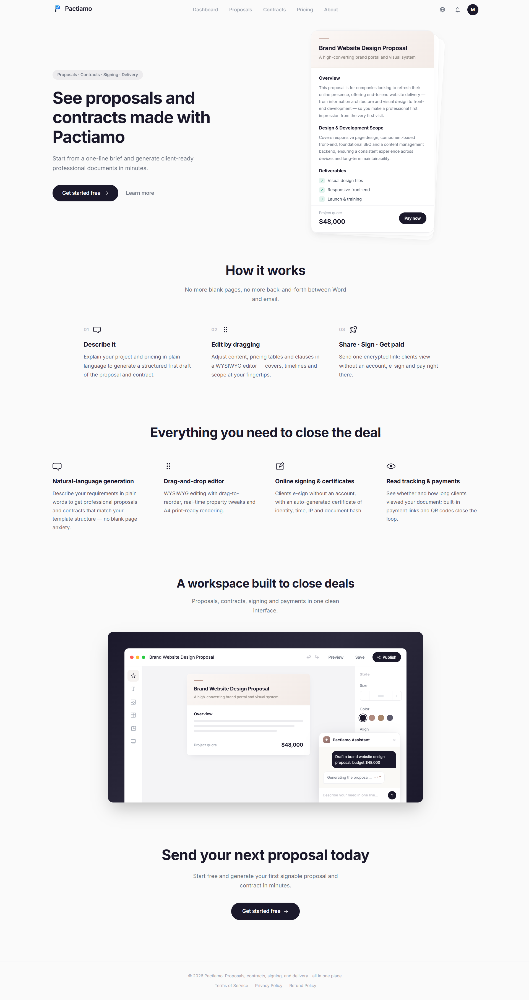

# Pactiamo Showcase

Pactiamo is an all in one workspace designed specifically for freelancers, independent developers, and small studios. It handles the entire deal closing process from a single line of text to a signed contract and payment.

## Overview

Closing deals as a freelancer often involves a scattered process: drafting in Word, exporting to PDF, emailing, revising, and chasing signatures and payments. Pactiamo simplifies this into one streamlined flow.

* [Features Detailed Breakdown](Features.md)
* [How It Works](HowItWorks.md)
* [Compliance and Payments](Compliance.md)

## Key Value Propositions

*   **Natural language generation**: Turn a brief description into a professional proposal and contract instantly.
*   **One link for everything**: Clients receive a single encrypted link where they can view, sign, and pay.
*   **Zero friction for clients**: No account registration is required for your clients.
*   **Direct payments**: Funds go straight to your Stripe or PayPal account. We never touch your money.

## Application Interface

Here is a quick look at the main workspace:

